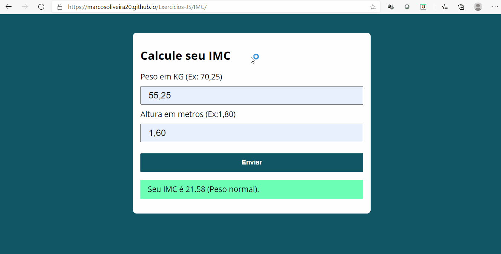
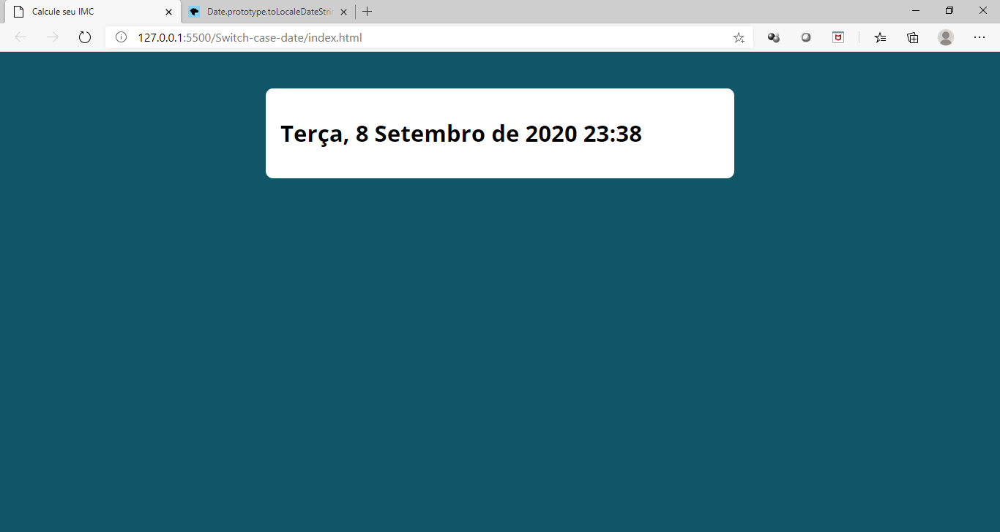

# Exercicios-JS

Exercícios Feitos com Javascript, com a intenção de exercitar todos os conteúdos aprendidos. E assim por a mão na massa pois todos sabemos que a melhor forma de aprender é praticar 

## Projetos

  
IMC

  
 Neste mini projeto foi possível exercitar manipulação de elementos HTML em umá pagina e exercitar um pouco mais o conhecimento sobre funções.<a href="https://marcosoliveira20.github.io/Exercicios-JS/IMC/" target="_blank"> Clique aqui </a> e dê uma olhadinha no projeto funcional no github pages

    <ul>
      
    </ul>
  

    
Switch case e datas

  
 Neste mini projeto foi possível exercitar manipulação de elementos HTML junto com manipulação de datas e sem esquecer do uso do switch case <a href="https://marcosoliveira20.github.io/Exercicios-JS/Switch-case-date/" target="_blank">. Clique aqui </a> e dê uma olhadinha no projeto funcional no github pages

    <ul>
      
    </ul>

