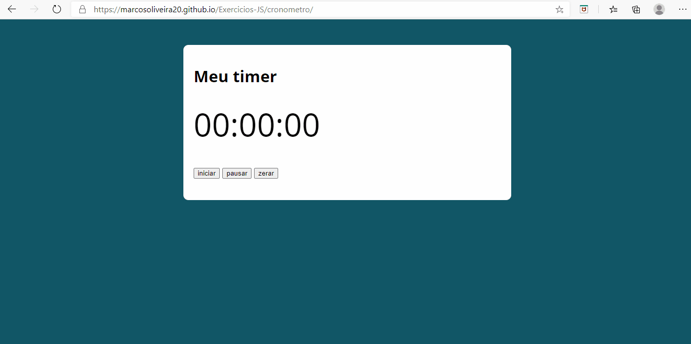
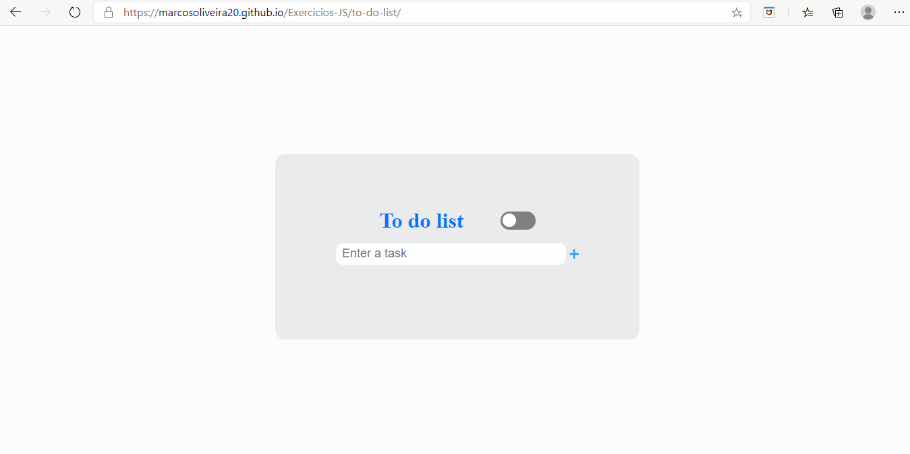

# Exercicios-JS

Exercícios Feitos com Javascript, com a intenção de exercitar todos os conteúdos aprendidos. E assim por a mão na massa pois todos sabemos que a melhor forma de aprender é praticar 

 

## Projetos

  
IMC

  
 Neste mini projeto foi possível exercitar manipulação de elementos HTML em umá pagina e exercitar um pouco mais o conhecimento sobre funções.<a href="https://marcosoliveira20.github.io/Exercicios-JS/IMC/" target="_blank"> Clique aqui </a> e dê uma olhadinha no projeto funcional no github pages

    <ul>
      
    </ul>
  

    
Switch case e datas

  
 Neste mini projeto foi possível exercitar manipulação de elementos HTML junto com manipulação de datas e sem esquecer do uso do switch case <a href="https://marcosoliveira20.github.io/Exercicios-JS/Switch-case-date/" target="_blank">. Clique aqui </a> e dê uma olhadinha no projeto funcional no github pages

    <ul>
      
    </ul>

    
Cronometro

  
 Neste mini projeto foi possível exercitar manipulação de elementos HTML junto com manipulação de tempo com funções nativas de JS <a href="https://marcosoliveira20.github.io/Exercicios-JS/cronometro/" target="_blank">. Clique aqui </a> e dê uma olhadinha no projeto funcional no github pages

    <ul>
      
    </ul>

    
To-do-list

  
 Neste mini projeto foi possível exercitar manipulação de elementos HTML. Além disto foi possível usar o Local Storage para guardar as tarefas do user e assim mesmo que ele recarregue a pag não perderá as tarefas salvas <a href="https://marcosoliveira20.github.io/Exercicios-JS/to-do-list/" target="_blank">. Clique aqui </a> e dê uma olhadinha no projeto funcional no github pages

    <ul>
      
    </ul>

 

## Próximos projetos

- **Falta Quanto App** - Digamos que você esteja na faculdade e queira saber o quanto falta você tirar para poder ser aprovado em determinada matéria.Ou ainda, digamos que você queira controlar o seu orçamento em quanto gastar com comida,diversão,transporte, hospedagem e compras em uma viagem. Crie uma aplicação que faz isso pra você. É certo que você poderia muito bem utilizar uma planilha de excel, mas ao invés disso, crie um formulário e adicione as validações necessárias e os alertas necessários para você não ser reprovado ou ficar sem dinheiro. <a href="http://programadorobjetivo.co/simples-projetos-para-aprender-javascript/"> Clique aqui</a> para ver o site de onde para ver o site de onde foi tira a ideia 

